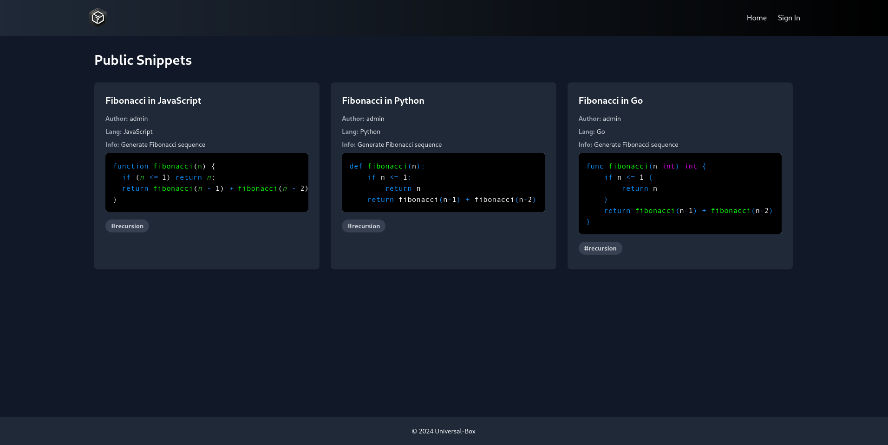
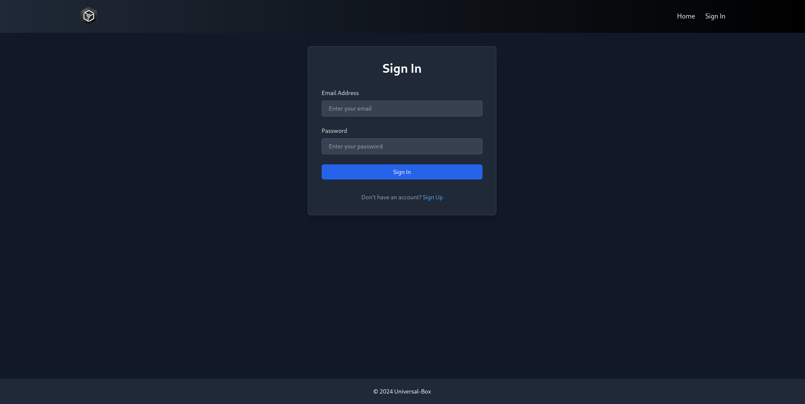
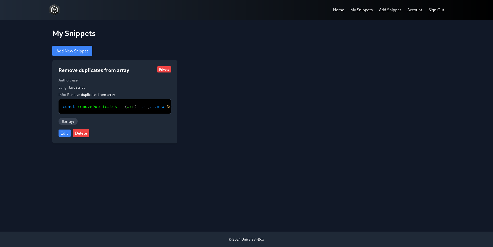
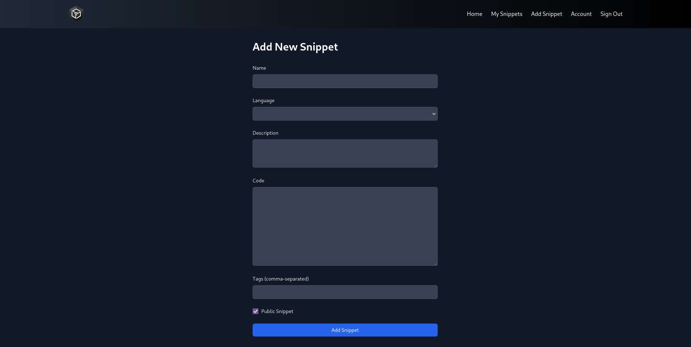
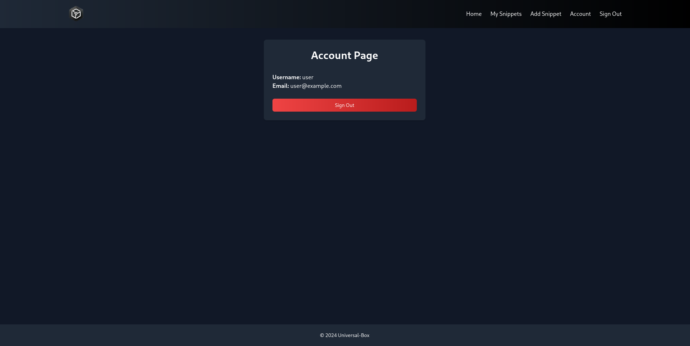

# FullStack Template: Vue.js + Go Fiber

This repository provides a simple FullStack template for building modern web applications using **Vue.js** for the frontend and **Go Fiber** framework for the backend. It includes essential features such as: CRUD operations, user authentication, session management, and a responsive user interface.

## Features
- **Frontend**: Built with Vue.js, offering a dynamic and responsive user interface.
- **Backend**: Powered by Go Fiber, providing a robust RESTful API.
- **Session Management**: Utilizes JSON Web Tokens (JWT) to manage user authentication.
- **User Authentication**: Supports user registration, login, and logout with session management using JWT.
- **Snippet Management**: Users can create, read, update, and delete code snippets with syntax highlighting and tagging support.
- **Public and Private Snippets**: Users can mark snippets as public or private.
- **Tagging and Browsing by Tags**: Snippets can be tagged, and users can browse snippets by tags.
- **Syntax Highlighting**: Supports syntax highlighting for multiple programming languages using rismjs.
---

# Screenshots:

### Public Snippets


### Login


### Private Snippets


### Add new Snippet


### Account

---

## Technologies Used

### Frontend

- **Vue.js 3**: A progressive JavaScript framework for building user interfaces.
- **Vue Router**: Handles navigation and routing in the application.
- **Pinia**: State management library for Vue.js applications.
- **Pinia Plugin Persistedstate**: Persists the state of Pinia stores across sessions.
- **Tailwind CSS**: Utility-first CSS framework for rapid UI development.
- **Vue Toastification**: For displaying toast notifications.
- **Prism.js**: For syntax highlighting of code snippets.
- **Vue3 Code Block**: A component for displaying code blocks with syntax highlighting.
- **Axios**: For making HTTP requests to the backend API.

### Backend

- **Go**: Modern language well-suited for efficient backends.
- **Go Fiber**: An Express-inspired web framework written in Go.
- **GORM**: An ORM library for Go, used for database operations.
- **PostgreSQL**: Relational database for storing user data and snippets.
- **JWT (dgrijalva/jwt-go)**: Create and verify JWTs for user authentication.
- **bcrypt**: Used for hashing user passwords securely.
- **godotenv**: Loads environment variables from a `.env` file.

## Installation

### Prerequisites

Ensure that **Go**, **Node.js**, and **PostgreSQL** are installed and running on your system.

### Steps

1. **Backend Setup**:

   - **Install Dependencies**:

     ```bash
     cd server
     go mod tidy
     ```

   - **Environment Variables**:

     Create a `.env` file in the `server` directory:

     ```bash
     # server/.env
     POSTGRES_URL="postgresql://<username>:<password>@<host>:<port>/<database>"
     JWT_SECRET=password
     PORT=3000
     ALLOWED_ORIGINS=http://localhost:5173
     ADMIN_USERNAME=admin
     ADMIN_EMAIL=admin@example.com
     ADMIN_PASSWORD=password
     ```


   - ⚠️ **Important : Database Setup** 

      Make sure that your PostgreSQL database is running. Edit the `.env`  `POSTGRES_URL` value to match your setup 

   - **Run the Backend Server**:

     ```bash
     go run .
     ```

     The backend server will automatically migrate the database schema and seed initial data.

2. **Frontend Setup**:

   - **Install Dependencies**:

     ```bash
     cd client
     npm install
     ```

   - **Environment Variables** (Optional):

     If your backend API is running on a different URL than `http://localhost:3000`, create a `.env` file in the `client` directory and set the `VITE_BACKEND_URL` variable.

     ```bash
     # client/.env
     VITE_BACKEND_URL=http://localhost:3000
     ```

   - **Run the Frontend**:

     ```bash
     npm run dev
     ```

3. **Access the Application** at `http://localhost:5173/`

## Routes and Functionalities

### Backend API Endpoints

#### Authentication

- **`/api/auth/signup` [POST]**:
  - Handles user registration.
  - **Request Body**:
    - `username`: String
    - `emailid`: String
    - `password`: String

- **`/api/auth/signin` [POST]**:
  - Handles user login.
  - **Request Body**:
    - `emailid`: String
    - `password`: String

#### User

- **`/api/user/signout` [POST]**:
  - Logs the user out by clearing the JWT token.

- **`/api/user/profile` [GET]**:
  - Retrieves the user profile information of the authenticated user.
  - **Requires Authentication**.

- **`/api/user/test` [GET]**:
  - Test route to verify the API is working.

#### Snippets

- **`/api/snippets` [GET]**:
  - Retrieves all public snippets.

- **`/api/snippets/languages` [GET]**:
  - Retrieves the list of supported programming languages.

- **`/api/snippets/user` [GET]**:
  - Retrieves the authenticated user's snippets.
  - **Requires Authentication**.

- **`/api/snippets/:id` [GET]**:
  - Retrieves a specific snippet by ID.
  - **Requires Authentication** for private snippets.

- **`/api/snippets` [POST]**:
  - Creates a new snippet.
  - **Requires Authentication**.
  - **Request Body**:
    - `name`: String
    - `description`: String
    - `code`: String
    - `language`: String
    - `tags`: String (comma-separated)
    - `visibility`: Boolean (true for public, false for private)

- **`/api/snippets/:id` [PUT]**:
  - Updates a snippet.
  - **Requires Authentication**.
  - **Request Body**: Same as for creating a snippet.

- **`/api/snippets/:id` [DELETE]**:
  - Deletes a snippet.
  - **Requires Authentication**.

### Frontend Routes

- **`/` [GET]**:
  - Displays all public snippets.

- **`/signin` [GET]**:
  - Sign-in page.

- **`/signup` [GET]**:
  - Sign-up page.

- **`/account` [GET]**:
  - User's account page, displaying user information.
  - **Requires Authentication**.

- **`/snippets` [GET]**:
  - Displays the authenticated user's snippets.
  - **Requires Authentication**.

- **`/add-snippet` [GET]**:
  - Form to add a new snippet.
  - **Requires Authentication**.

- **`/edit-snippet/:id` [GET]**:
  - Form to edit an existing snippet.
  - **Requires Authentication**.

- **`/tag/:tag` [GET]**:
  - Displays all public snippets that have the specified tag.

## Flash Messages

The application uses toast notifications to communicate various events to the user:

- **Signup**:
  - **Success**: "Signup successful! Please sign in."
  - **Error**: Display server error message.

- **Signin**:
  - **Success**: "Signed in successfully!"
  - **Error**: Display server error message.

- **Signout**:
  - **Success**: "Sign out successful!"
  - **Error**: Display server error message.

- **Snippet Operations**:
  - **Add Snippet Success**: "Snippet added successfully."
  - **Edit Snippet Success**: "Snippet updated successfully."
  - **Delete Snippet Success**: "Snippet deleted successfully."
  - **Error**: Display server error message.

These messages are displayed on the frontend using Vue Toastification.

## Database

The application uses **PostgreSQL** for persistence.

### Models

#### User

- **ID**: Unique identifier for each user.
- **Username**: Unique username.
- **Email**: Unique email address.
- **Password**: Hashed password.

#### Snippet

- **ID**: Unique identifier for each snippet.
- **Name**: Name of the snippet.
- **Description**: Description of the snippet.
- **Code**: The code content.
- **Language**: Programming language of the snippet.
- **Tags**: Comma-separated tags associated with the snippet.
- **Visibility**: Boolean indicating if the snippet is public or private.
- **UserID**: The ID of the user who owns the snippet.

#### Language

- **ID**: Unique identifier for each language.
- **Name**: Name of the language.

### Seeding Data

Upon first run, the backend server will seed initial data:

- **Languages**: A list of supported languages loaded from `data/languages.json`.
- **Admin User**: An admin user with credentials specified in the `.env` file.
- **Sample Snippets**: Sample code snippets loaded from `data/snippets.yaml`.

---

Made using [Universal-Box](https://github.com/Abhishek-Mallick/universal-box)