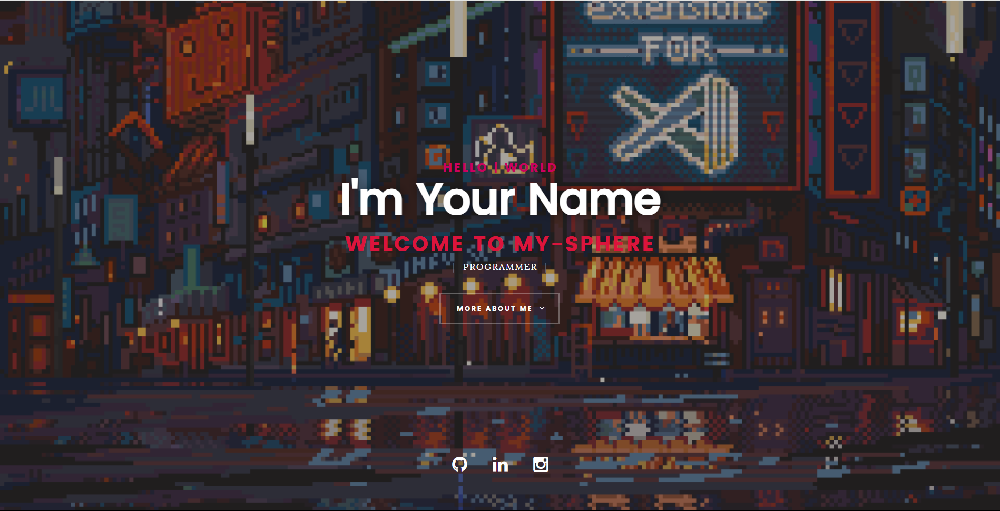
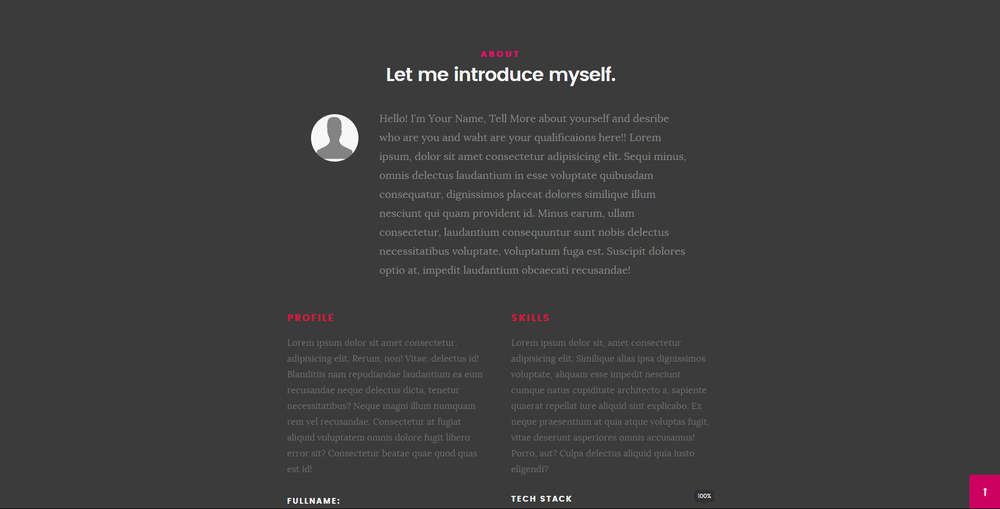
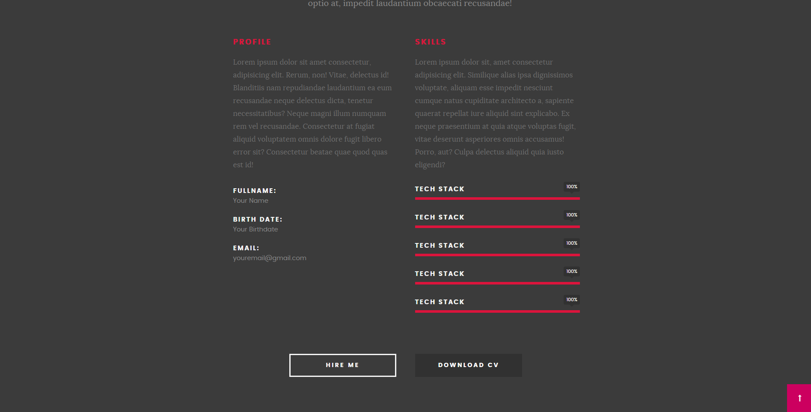
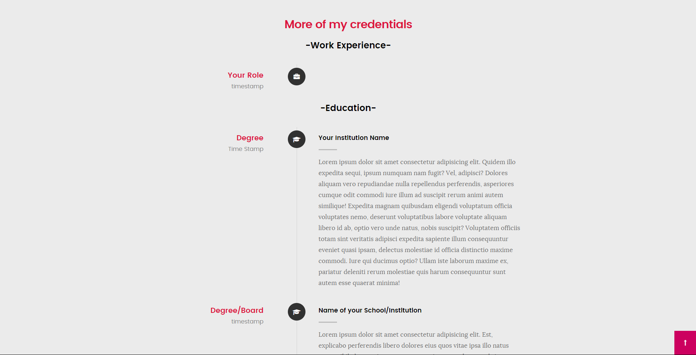
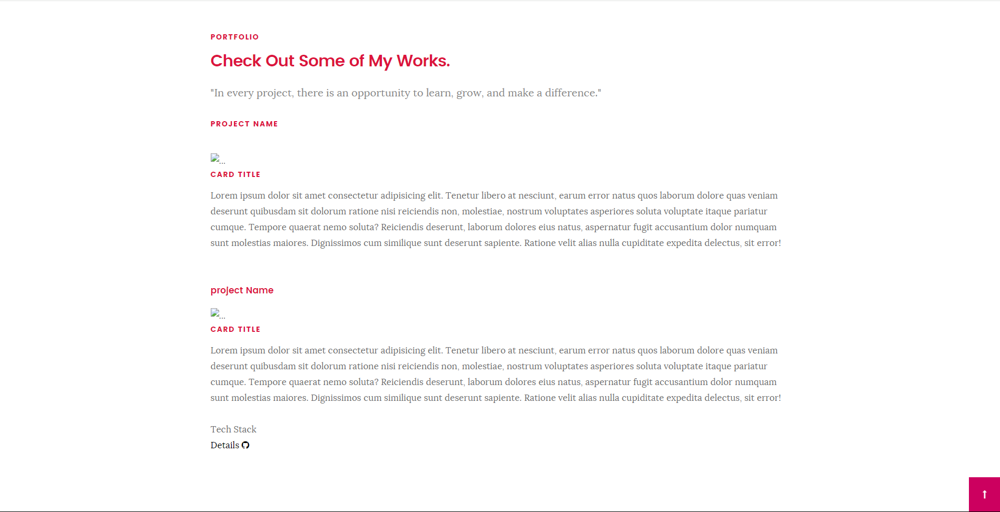
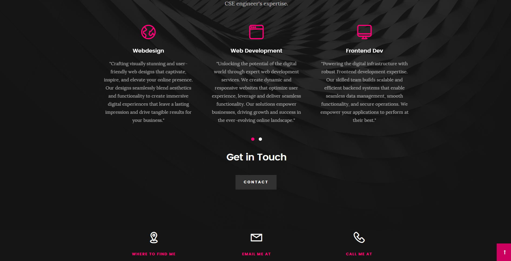
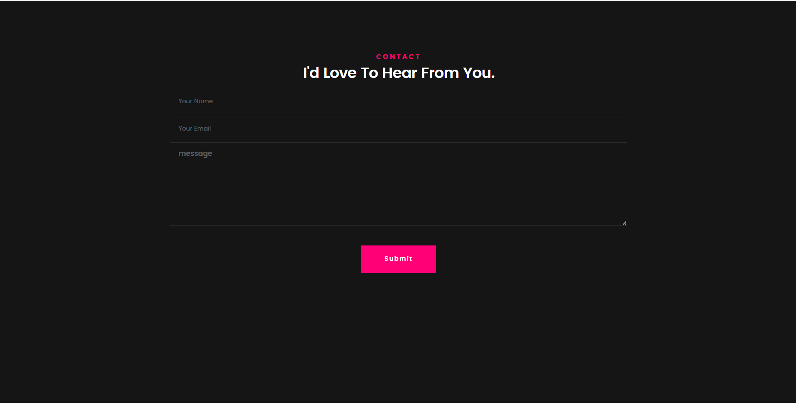

# Portfolio Website

## Introduction

This **Portfolio Website** is a simple, responsive digital portfolio built using HTML, CSS, and JavaScript. It allows individuals to showcase their skills, experience, and projects in a professional manner.

## Features

- **Responsive Design**: The layout is adaptable for all screen sizes (mobile, tablet, desktop).
- **Interactive UI**: Uses animations, hover effects, and smooth scrolling to improve user interaction.
- **Skills Showcase**: Displays skill levels using progress bars or icons.
- **Projects Section**: A detailed display of personal or professional projects with links for more information.
- **Contact Form**: A working contact form for potential clients or collaborators to reach out.
- **Social Media Links**: Links to various social media profiles.
- **Testimonials (Optional)**: Showcase feedback or reviews from clients or colleagues.

## Technologies Used

- **HTML**: Structure of the web pages.
- **CSS**: Styling and layout, including responsive design.
- **JavaScript**: Adds interactivity and dynamic features to the site.

## Demo









## Installation Steps
To utilize the Portfolio-Website Template with Universal-Box, follow these steps:

1. **Initialize the project**:
   ```bash
   universal-box init
   ```
2. **Select the Portfolio-Website Template**:
Select the following from the menu:
   ```bash
    Portfolio-Websites > Simple > HTML-CSS > v2
    ```
3. **Run**:
Navigate to your project directory and run:
    ```bash
    Run using LiveServer at index.html
    ```
4. **Access the Portfolio-Website**:Open your browser and navigate to `http://127.0.0.1:5500/template/Portfolio-Websites/Simple/HTML-CSS/v2/index.html`.


Visit codebase [here](https://github.com/Abhishek-Mallick/universal-box/tree/main/template/Portfolio-Websites/Simple/HTML-CSS/v2)